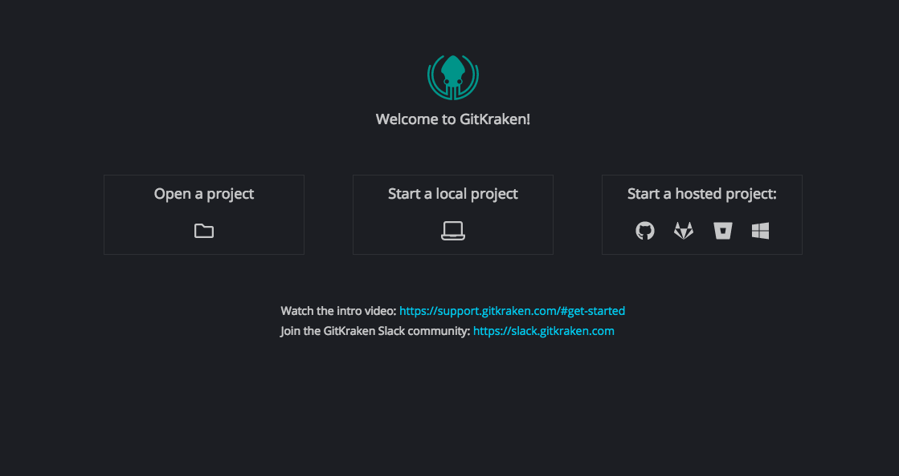

# Getting Started with Git

"Version Control System" is the technical/software term used to describe Git and the term that will come up most often when it is googled. But Git can be used by **anybody** and will most probably improve the quality of your work if you decide to use it when writing papers, code etc.

**If you have any questions, technical issues, or feedback on any part of this document feel free to contact Yulric Sequeira either by email at ysequeira@ohri.ca or open an issue here https://github.com/Big-Life-Lab/GettingStartedWithGit/issues**

## What is Git

Git is used to track files and these can range from simple text files, program files like ones written for SAS, R, Javascript, and data files like CSV files, etc. (don't try it with MS Word files though since these are binary files). You should use Git if you....

- Want to avoid the hell that is versioning using file names. If you have a folder where the file names look like "File_2018-01-11.txt", "File_2018-01-11-final.txt" etc., then use Git! It avoids this entire issue by using a concept called commits
- Want to know exactly what changes were made from one version of a file to another. This is one of the most powerful features of Git and is not only built into it but also a host of programs exist online that show this in an intuitive way
- Want a workflow that encourages collabration rather than hindering or discouraging it. Git has features like branching, stashing etc. that makes collabaration painless
- Are tired of continously making copies of files before making changes to them due to fear of making a mistake, overwriting somebody else's work etc.

Convinced? Then read on!

## Things you will need

If you are a first time Git user then we highly recommend starting out with Git Kracken https://www.gitkraken.com/git-client.

Once you have downloaded, installed and run the program you will need to login using your Github credentials. There should be a button named "Sign in with github". This will open up your browser and you should follow the instructions there to get everything setup

Continue to the next sections only after you reach a screen with a button named "Open a project" 

## Basic Git Concepts (or how to earn a PBL sticker!)

The next few sections provide a practical introduction at the end of which if everything goes right (fingers crossed) your name should appear here https://github.com/Big-Life-Lab/GettingStartedWithGit/blob/master/gitters.md

### [Repositories and Cloning](repositories-and-cloning.md)

### [Adding, Staging and Commiting](adding-staging-commiting.md)

### [Local Repo, Remote Repo, Pushing and Pulling](local-remote-pushing-pulling.md)

### [Diffing](diffing.md)

## What's next?

If you have completed all the parts in this section then congrats! You have earned a PBL sticker which Karen Pacheco should be happy to give to you provided you show proof of your work. There are still other poweful git features outlined in the Advanced Git Concepts section however these should be more than enough to get you going. Happy gitting!

## Advanced Git Concepts

The basic concepts you learned in the previous section will go a long way when working on solo projects. However, when working on team projects things start to get hairy without the concepts outlined in this section. Features like **branching** and **pull requests** enable the development of workflows that
make collaboration much smoother.

### [Branching, Checkout and Merging](/advanced-concepts/branching-checkout.md)

### [Pull Requests](/advanced-concepts/pull-requests.md)

### Stashing (WIP)
