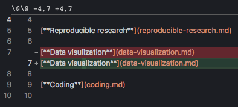
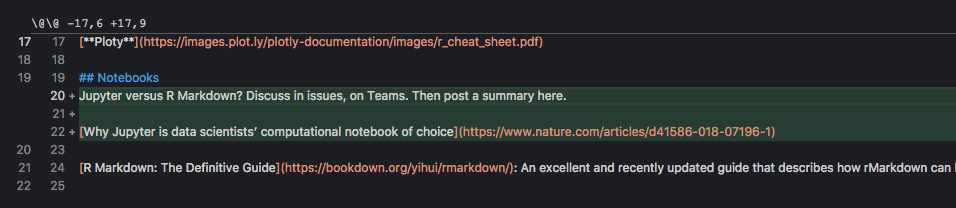
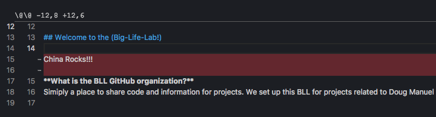

# Diffing

In the last section on "Basic Git Concept" we will go over git diffs. Git difs are a powerful feature that not only allow us to see what files have changed from one commit to another but also what exactly has been changed in each file.

In Gitkracken the middle panel shows all the commits that have been made in the repo in chronological order. Your commit should be at the very top and should be distinguishable by the commit message.

Click on your commit now.

While a commit is selected the right most panel shows the changes made in the commit at the file level. There are 3 types of file changes and git kracken distinguishes between them by using icons:

-  This file was added in the commit
-  This file was removed in the commit
-  This file was modified in the commit. This means lines were added, removed or modified

In the right hand panel currently you should see only one file "our-team.md"

Clicking on the modified file in this panel tells you exactly what changes were made to the file. For example:

-  This says that line 7 was modified and the letter 'a' was added to the word visualization
-  This says that lines 20 to 22 were added to this file
-  This says that line 14 was removed from this file

Click the our-team.md file in the right hand panel to see the line you added to the file
