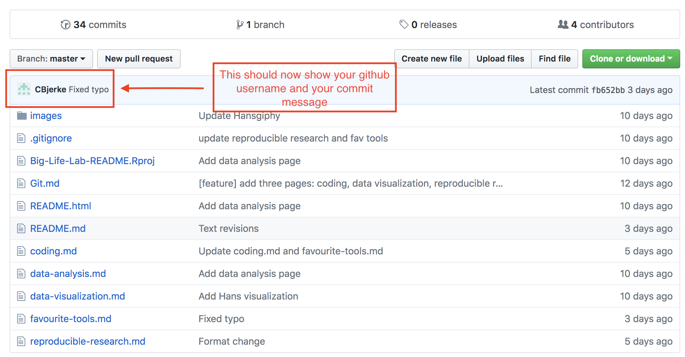

# Local Repo, Remote Repo, Pushing and Pulling

Git allows you to sync all the changes you have made to a repo on your computer with the cloud. If you have ever used a tool like Dropbox, Microsoft OneDrive or Google Drive it works almost the same way.

Before we define what syncing in git does, we should go over the concept of a **local** and **remote** repo

A **local** repo is a git repo that is on your computer. For eg., the GettingStartedWithGit repo that is currently on your computer is a local repo

A **remote** repo is a git repo that is not on your computer. For eg., this repo that you see when you go to this link https://github.com/Big-Life-Lab/GettingStartedWithGit is a remote repo that is stored on github's computers

Remote repos allow you to backup your project so that you don't lose anything in case of a computer failure, so you can work on the project when you switch computers, and so other people can see your work

Local repos allow you to make changes to your project without showing those changes to anybody else or affecting somebody else' work

**Syncing** in git means to **pull** or download all the commits that are in a **remote** repo which you do not have to your **local** repo and to **push** or upload all the commits that are in your **local** repo which a **remote** repo does not have to the remote repo.

You can also decide to just push or to just pull in changes.

Currently you have one commit in your local repo that needs to be pushed to github or the remote repo. We will do this now.

1. If you look at the left hand side of git kracken you should see a section called LOCAL and underneath that the text master. If you did the previous section correctly you should see an arrow pointing upwards with the number 1 next to it. This means that you have one commit in your local repo that github does not have. Similarly if there's a downward arrow then there are commits in github that you do not have on your computer.
2. Push this commit to github (which is the commit you created in the last section) by clicking the Push button at the very top center of git kracken
3. Verify that your push was successful by going to the repo in github https://github.com/Big-Life-Lab/GettingStartedWithGit and seeing . Also your name should appear here https://github.com/Big-Life-Lab/GettingStartedWithGit/blob/master/gitters.md

Wonderful! You have successfuly pushed your changes to github
